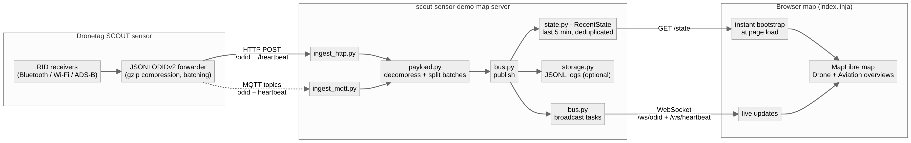
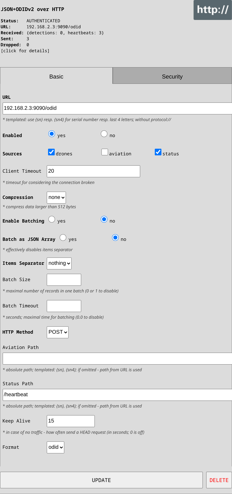

# Scout Sensor Demo Map

Scout Sensor Demo Map is a receiving side of SCOUT data. It provides an interactive map webpage showing drone positions and receiver statuses from SCOUT sensors via HTTP and MQTT.

## What this project demonstrates



*(diagram source: [`docs/architecture.mmd`](docs/architecture.mmd))*

The server is intentionally small and split by concern, so it doubles as a reference implementation for ingesting SCOUT data into your own system:

| Module | What it shows |
|--------|---------------|
| [`ingest_http.py`](src/scout_sensor_demo_map/ingest_http.py) | Receiving SCOUT's **JSON+ODIDv2 over HTTP** forwarder — detections POSTed to `/odid`, status heartbeats to `/heartbeat` |
| [`ingest_mqtt.py`](src/scout_sensor_demo_map/ingest_mqtt.py) | The same data consumed from an **MQTT broker** (`odid` and `heartbeat` topics) |
| [`payload.py`](src/scout_sensor_demo_map/payload.py) | SCOUT's wire format: gzip transport compression and message batching (`\n`, `\r\n`, concatenated or JSON array) |
| [`bus.py`](src/scout_sensor_demo_map/bus.py) | Fan-out of every ingested message to the connected WebSocket map clients, persistence and state bookkeeping |
| [`state.py`](src/scout_sensor_demo_map/state.py) | A last-5-minutes deduplicated airspace snapshot behind the `/state` endpoint, so a freshly opened map starts populated |
| [`storage.py`](src/scout_sensor_demo_map/storage.py) | Optional daily-rotated JSONL persistence of everything received |
| [`server.py`](src/scout_sensor_demo_map/server.py) | The aiohttp application: map page, WebSocket endpoints, `/state`, reverse-proxy prefix handling |
| [`templates/index.jinja`](src/scout_sensor_demo_map/templates/index.jinja) | The MapLibre map page consuming the WebSockets |

Both ingestion paths accept the same payloads and publish onto the same bus, so everything downstream (live WebSockets, `/state`, storage) is transport-agnostic.

## Requirements

- Python 3.10+
- MQTT broker (e.g. [mosquitto](https://mosquitto.org/))

## How to point your SCOUT to the Sensor Map

### 1 — Find your machine's local IP address

```sh
ip a          # Linux — look for the inet address on your LAN interface (e.g. eth0, wlan0)
ipconfig      # Windows
```

Example result: `192.168.1.42`

### 2 — Start the map server

```sh
scout-sensor-demo-map --http-port 9090
```

### 3 — Configure the SCOUT in its web interface

Open `https://<scout-ip>/forwarding` in your browser (replace `<scout-ip>` with the IP printed on your SCOUT device or shown in your router's device list).

In the SCOUT UI click **+ add new** and choose **JSON+ODIDv2 over HTTP**, then fill in — replace `<your-ip>` with the address from step 1:

| Field | Value |
|-------|-------|
| **URL** | `<your-ip>:9090/odid` |
| **Sources** | check `drones` and `status` |
| **Status Path** | `/heartbeat` |
| **Format** | `odid` |

Leave the remaining fields at their defaults and click **Create**. A correctly configured and connected forwarder looks like this (click its header to fold/unfold the settings):



The tile's **Status** should show `AUTHENTICATED` and the **Sent** counter should start increasing as heartbeats (and drone detections, when a drone is nearby) are forwarded to the map.

Details about the Dronetag Scout forwarder configuration can be found in the [Dronetag Scout help](https://help.dronetag.com/dronetag-scout/configuration/scout-heartbeat-forwarders).

### 4 — Open the map

Navigate to `http://localhost:9090` in your browser. The status indicators should turn green ("Connected") and drone positions will start appearing as data arrives.

---

## Installation

Make sure you have Python 3.10 or later installed (`python --version`).

### Using a virtual environment (recommended)

```sh
python -m venv .venv
source .venv/bin/activate           # Linux/macOS
.venv\Scripts\Activate.ps1          # Windows (may require: Set-ExecutionPolicy -ExecutionPolicy Bypass -Scope CurrentUser)
pip install scout-sensor-demo-map-<version>.tar.gz
```

### Automated install as a systemd service (Linux)

The `scripts/install.sh` script installs the package into a local venv and registers a system-wide systemd service that starts automatically on boot.

```sh
bash scripts/install.sh
```

What the script does:
1. Creates `scripts/venv/` and installs the package there.
2. Creates `scripts/storage/` for JSONL log files.
3. Writes `/etc/systemd/system/scout-sensor-demo-map.service` (requires `sudo`).
4. Runs `systemctl enable --now scout-sensor-demo-map`.

The service runs as the **current user** (the one who executes the script).

Useful commands after installation:

```sh
systemctl status scout-sensor-demo-map       # check running state
journalctl -u scout-sensor-demo-map -f       # follow live logs
sudo systemctl stop scout-sensor-demo-map    # stop
sudo systemctl disable scout-sensor-demo-map # remove from autostart
```

---

## Usage

```sh
scout-sensor-demo-map [--http-port PORT] [--mqtt-port PORT] [--mqtt-address HOST] [--mqtt-start] [--http-local-only] [--storage DIR]
```

| Flag | Default | Description |
|------|---------|-------------|
| `--http-port` | `9090` | HTTP server port |
| `--mqtt-port` | `1883` | MQTT broker port |
| `--mqtt-address` | `localhost` | MQTT broker address |
| `--mqtt-start` | off | Start a local mosquitto instance on the given port |
| `--http-local-only` | off | Bind HTTP server to `127.0.0.1` only |
| `--storage DIR` | off | Directory to persist received messages as JSONL files |
| `--debug` | off | Enable debug logging |
| `--silent` | off | Suppress all non-error logs |

### Message storage (`--storage`)

When `--storage <dir>` is provided the server appends every received message to two JSONL files inside that directory:

| File | Contents |
|------|----------|
| `telemetry_YYYY-MM-DD.jsonl` | Drone ODID / telemetry messages (HTTP `POST /odid` and MQTT topic `odid`) |
| `heartbeat_YYYY-MM-DD.jsonl` | Sensor heartbeat messages (HTTP `POST /heartbeat` and MQTT topic `heartbeat`) |

A new pair of files is created automatically at midnight, so each calendar day has its own logs.

Each line is a JSON object with three fields:

```json
{"received_at": 1748908800.123, "source": "http", "data": { ... }}
```

| Field | Description |
|-------|-------------|
| `received_at` | Unix timestamp (seconds, float) when the message was received |
| `source` | `"http"` or `"mqtt"` |
| `data` | Parsed JSON payload; raw string if the payload was not valid JSON |

The directory is created automatically if it does not exist.

Example:

```sh
scout-sensor-demo-map --storage /var/log/scout-map
```

---

## Deployment behind a reverse proxy

The server reads standard forwarded headers set by reverse proxies such as nginx or Traefik:

| Header | Purpose |
|--------|---------|
| `X-Forwarded-Host` | External hostname seen by the client |
| `X-Forwarded-Proto` | External protocol (`http` or `https`) |
| `X-Forwarded-For` | Original client IP address |
| `X-Forwarded-Prefix` | URL path prefix the proxy strips before forwarding |

When `X-Forwarded-Prefix` is set (e.g. `/map`), redirect responses and the `url()` Jinja template helper automatically include the prefix, so the app works correctly at a sub-path.

---

## Development

### Setup

```sh
python -m venv .venv
source .venv/bin/activate
pip install -e ".[dev]"
```

### Code quality

```sh
ruff check src/            # lint
ruff format src/           # format
pyright src/               # strict type-check
```

### Testing

Tests use [pytest-playwright](https://playwright.dev/python/) and require a Chromium browser. Install it once:

```sh
playwright install --with-deps chromium
```

Then run the full test suite:

```sh
pytest
```

The tests start a local aiohttp server (no MQTT required) and use a headless Chromium browser to verify:

- the page renders with the map and UI controls visible
- both WebSocket endpoints (`/ws/odid` and `/ws/heartbeat`) reach the "Connected" state
